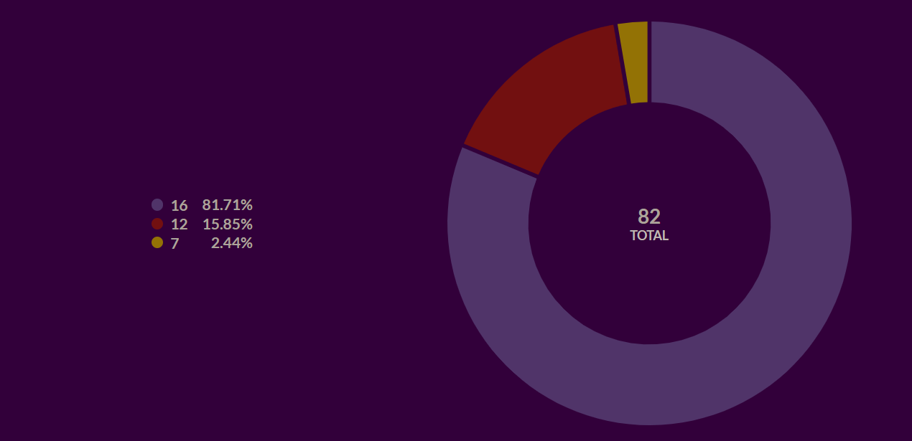
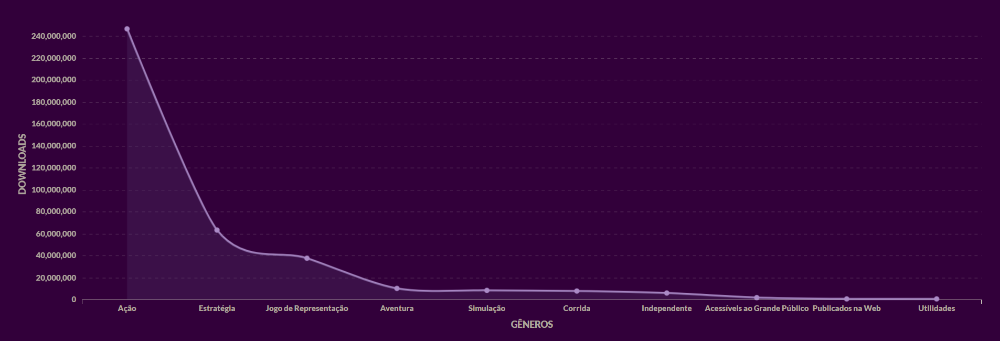
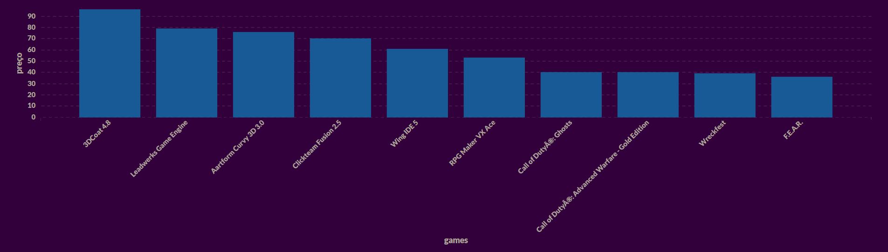

#  STEAM Database

 

 

## 🔖 Descrição:

✨ Projeto de conclusão do Módulo 3 da <a href="https://www.resilia.com.br/">Resilia Educação</a> ✨

O projeto teve como objetivo a criação de um banco de dados MySQL para criar consultas e gráficos interpretativos sobre o tema. Para a análise de dados, foi utilizada a ferramenta Metabase.

Foi utilizado SCRUM como metodologia ágil para a organização do projeto, com o uso da ferramenta Trello.

Para a demonstração detalhada das perguntas, gráficos e análises, foi desenvolvido um site em HTML, CSS e JavaScript (ES6), cujo protótipo foi desenvolvido no Figma.

 

## 📋 Perguntas utilizadas:

<ul style="list-style: square;">
    <li>Entre os jogos por menos de 4 dólares, quantos possuem a quantidade de avaliações positivas acima da média?</li>
    <li>Quais são os 10 jogos mais caros e quais os seus gêneros?</li>
    <li>Qual é a quantidade de jogos e seus preços com as categorias 'competitive' e 'cross-platform'?</li>
    <li>Entre 2070 registros, quantos jogos possuem, e quantos não possuem, inglês como linguagem oficial e qual a média de suas avaliações positivas e negativas?</li>
    <li>Dos jogos que possuem e-mail de suporte, há mais avaliações positivas ou negativas?</li>
    <li>Quais desenvolvedoras acumulam a maior quantidade de avaliações negativas?</li>
    <li>Quais jogos sem classificação mínima de idade possuem a tag 'assassin' e qual o tempo médio de jogo dedicado a eles?</li>
    <li>Quantos jogos possuem a idade recomendada de 7, 12 e 16 anos, respectivamente?</li>
    <li>Quais são os 5 gêneros com maior restrição de idade?</li>
    <li>Quantos jogos possuem um website oficial para suporte?</li>
    <li>Qual é a quantidade acumulada de downloads de jogos de acordo com o gênero (separado por gêneros individuais)?</li>
    <li>Qual é a quantidade de jogos que possuem a categoria ou o gênero 'ação', por desenvolvedora (entre as 10 primeiras)?</li>
    <li>Quais anos tiveram mais jogos lançados ente os últimos 10 anos?</li>
    <li>Quais jogos possuem uma descrição, e quais são as suas desenvolvedoras?</li>
</ul>

 

## 📉 Algumas análises:

 

 

## 🛠️ Tecnologias e ferramentas utilizadas:

 

## 👥 Equipe:

 

<table align="center">
    <tr>
        <td align="center">
            
            

            <h3>Helena Machado</h3>
            

            

                
                
            

        </td>
        <td align="center">
            
            

            <h3>Vitor Giorgio</h3>
            

            

                
                
            

        </td>
        <td align="center">
            
            

            <h3>Milena Souza</h3>
            

            

                
                
            

        </td>
        <td align="center">
            
            

            <h3>Tiago Silva</h3>
            

            

                
                
            

        </td>
        <td align="center">
            
            

            <h3>Gabriel Lima</h3>
            

            

                
                
            

        </td>
    </tr>
</table>
